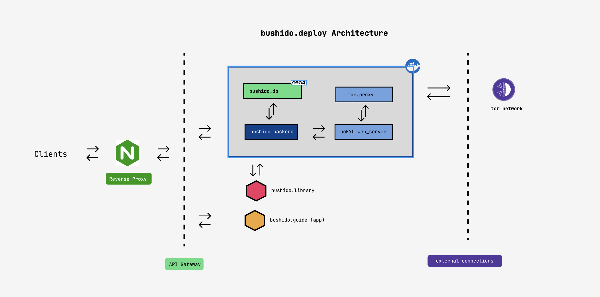

# Overview
Automatise bushido.guide deployment in a VPS

# Motivation
When we spin up the docker file (`docker-compose`), it builds four different containers: database (neo4j), [`bushido web server`](https://github.com/tipogi/bushido-backend) and market server and tor proxy from [bushido.market](https://github.com/tipogi/bushido.market)



The only container that external actors can access is `bushido web server` as a API endpoint and the rest of the containers access is restricted to the local docker network.

Also, it has another two services outside of the containers which have different responsabilities:
- `bushido.guide`: It is the client of the application and nginx delivers that files to the end-user
- [`bushido.library`](https://github.com/tipogi/bushido.library): Feeds the graph database with topics and domains

# Folders
The repository has different folders with some utility in the process of deploying the application
- `configuration`: All the constant files that has to be edited before spin up the container
- `docker`: All the containers directory
- `scripts`: Automatise application deploy. Pull services, create the bundle, configure the environments of each service and more.
  - **init.sh**: Pull repositories and add its own environment variables
  - **install.sh**: Create the bundles and move to the containers location to spin up the application
  - **color.sh**: Terminal coloring helper function
  - **path.sh**: Path constants helper


# Scripts
Automatise application deploy. Pull services, create the bundle, configure the environments of each service and more
- **init.sh**: Pull repositories and add its own environment variables. Environment files to edit inside docker folder:
  - .env (docker compose environment file)
  - bushido.backend/database/.env DEPRECATED, not in use
  - bushido.backend/deploy/core/config/environment/**wished_env.yml** *(for example: production.yml)*
  - bushido.backend/deploy/core/config/external_connections.ts
  - bushido.guide/src/constants/config.constants.ts
  - bushido.library/cli/src/config/environment/**wished_env.yml** *(for example: production.yml)*
  - bushido.library/cli/src/.env  ( the environment name has to be the same name of yml but without extension)
- **install.sh**: Create the bundles and move to the containers location to spin up the application
  - bushido.backend/deploy/core/.env ( the environment name has to be the same name of yml but without extension)
  - Create .env file in `bushido.library` and also edit the `.yml` file
- **color.sh**: Terminal coloring helper function
- **path.sh**: Path constants helper

When we want to use `bushido.library`, we have to open the Neo4J ports to localhost because by default the ports are open inside of the container

# OS
Which packages needs that deployment to run in some VPS

# Docker
The application containers. After init all the scripts, we run these commands
```bash
# Build all the images
DOCKER_BUILDKIT=1 docker compose build
# Spin up the container
docker compose up
```
Also, we have to edit the .env file to set the neo4J credentials